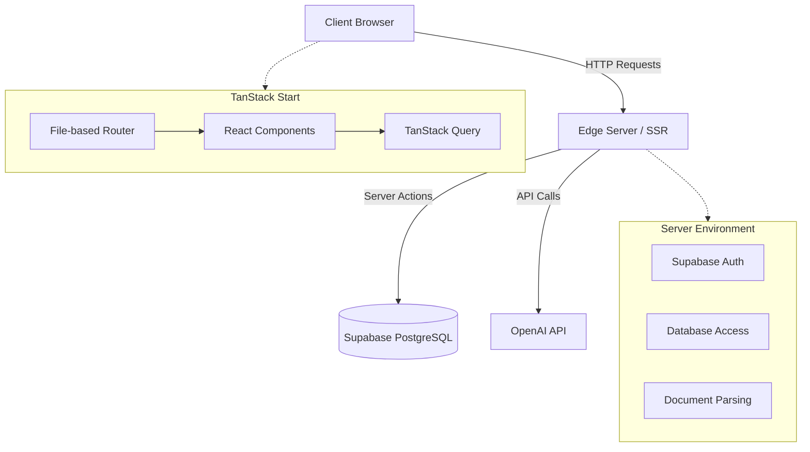
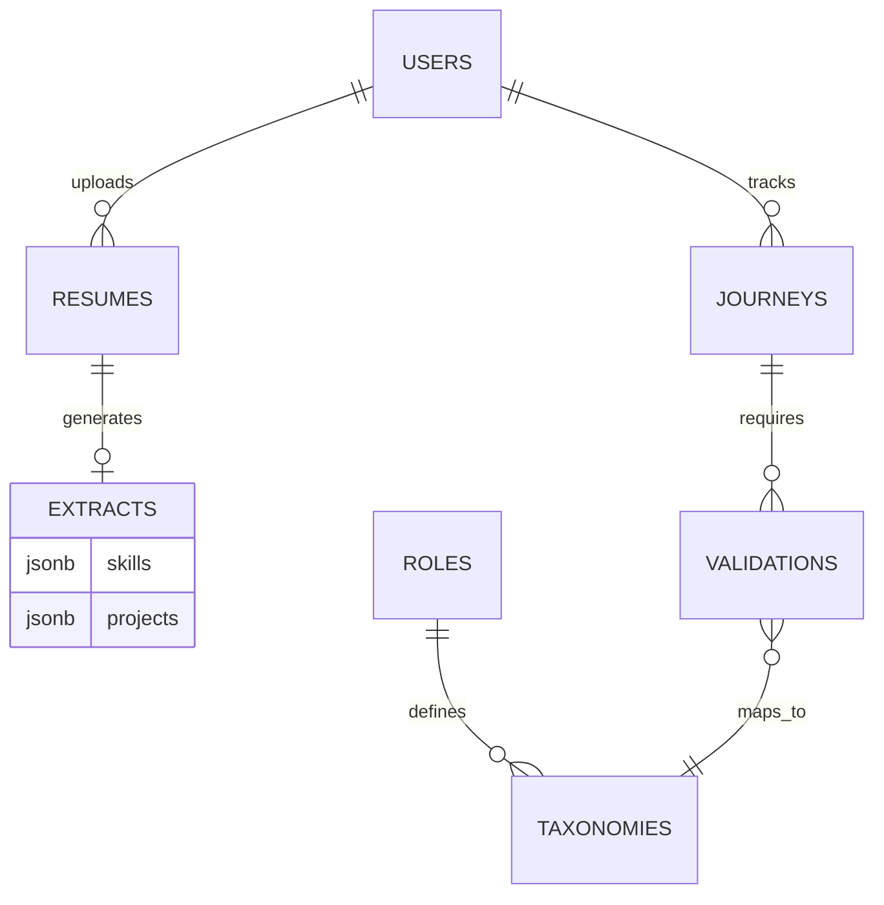

<div align="center">

# CareerPilot AI

**The engineering career operating system.**

[](https://tanstack.com/start)
[](https://www.typescriptlang.org/)
[](https://tailwindcss.com/)
[](https://vite.dev/)

[Live Demo](#) · [GitHub Repository](#)

</div>

---

## Why CareerPilot?

The software engineering job market requires precision. Yet, existing AI resume tools operate as opaque black boxes. They take a PDF and return generic, uncalibrated advice or completely hallucinated bullet points. They fail to understand the nuance of system design experience, technical ownership, and the specific requirements of senior engineering roles.

CareerPilot AI solves this by strictly separating AI extraction from business logic evaluation. The system uses AI only to extract factual evidence from unstructured documents. Deterministic, code-based rules then evaluate this evidence against a strict taxonomy of engineering skills. This architecture guarantees that every readiness score, gap analysis, and roadmap recommendation is reproducible, explainable, and technically accurate.

---

## Key Features

| Feature                  | Description                                                                                                         |
| ------------------------ | ------------------------------------------------------------------------------------------------------------------- |
| **Deep Resume Analysis** | Parses technical documents to extract skills, project scope, and ownership signals into a structured JSON graph.    |
| **Readiness Score**      | Calculates a deterministic metric indicating alignment with targeted engineering roles based on extracted evidence. |
| **Validated Experience** | Prompts users with structured questions to verify stated experience, preventing inflated self-ratings.              |
| **Personalized Roadmap** | Generates actionable, sprint-based learning plans tailored to identified skill gaps and timeline constraints.       |
| **Insights Dashboard**   | Visualizes skill matrices and role-fit using standard engineering metrics and trend lines.                          |

---

## Product Walkthrough

The user journey is designed to systematically evaluate and improve engineering market readiness.

1. **Resume Upload**: The user submits their current resume (PDF/DOCX).
2. **AI Analysis**: The system extracts entities, skills, and project context without evaluating them.
3. **Validation**: The user answers targeted questions to substantiate the extracted experience.
4. **Readiness**: The application compares verified skills against a target role taxonomy to generate a deterministic score.
5. **Gap Analysis**: The system identifies specific technical deficiencies preventing role alignment.
6. **Roadmap**: A structured learning sprint is constructed to close the identified gaps.

---

## Screenshots

> [!NOTE]
> _Screenshots will be added here upon final deployment._

- **Landing Page**
- **Dashboard Overview**
- **Resume Management**
- **Insights & Metrics**
- **Validation Flow**
- **Learning Roadmap**
- **User Profile**
- **Mobile View**
- **Dark Mode Interface**

---

## Architecture

The application follows a modern SSR architecture using TanStack Start, ensuring optimal performance and SEO while maintaining a rich interactive client.



---

## AI Philosophy

**AI extracts evidence. The application makes decisions.**

LLMs are non-deterministic and prone to hallucination, making them unsuitable for direct evaluation of engineering candidates. CareerPilot AI limits the AI's role strictly to data extraction (parsing unstructured text into a rigid JSON schema).

By relying on strict business logic for evaluation, the system guarantees:

- **Reproducibility**: The same resume always yields the exact same identified gaps.
- **Explainability**: Users can trace any recommendation back to a specific missing skill in the taxonomy.
- **Consistency**: Evaluation rules apply uniformly across all users and roles.
- **Maintainability**: The skill taxonomy and evaluation criteria can be updated without retraining models or adjusting prompts.

---

## Engineering Principles

- **Store source data, compute derived data**: The database stores only raw resume text and user validation answers. Scores, gaps, and roadmaps are computed on the fly, ensuring that updates to the taxonomy instantly reflect across all user profiles without data migration.
- **Immutable AI snapshots**: AI extraction results are versioned and treated as immutable records.
- **Deterministic business logic**: Evaluation rules are hardcoded in TypeScript, ensuring predictable outcomes.
- **Validation before recommendations**: No learning plan is generated until the underlying experience is verified by the user.

---

## System Design

- **Frontend**: Built with React 19 and TanStack Start for file-based routing and SSR. UI components are built with shadcn/ui and styled using Tailwind CSS v4 with a custom oklch color system.
- **Backend**: TanStack Start server functions handle secure API communication, AI orchestration, and database interactions.
- **Database**: Supabase (PostgreSQL) provides persistent storage with Row Level Security (RLS) ensuring data isolation.
- **Authentication**: Supabase Auth handles user identity and session management.

---

## Database Design



---

## Tech Stack

- **Frontend Framework**: [TanStack Start](https://tanstack.com/start) - Chosen for robust SSR, type-safe routing, and seamless integration with React Query.
- **UI Library**: [React 19](https://react.dev) - Utilizes concurrent rendering and modern hooks.
- **Styling**: [Tailwind CSS v4](https://tailwindcss.com) - Provides a zero-configuration, utility-first styling engine.
- **Components**: [shadcn/ui](https://ui.shadcn.com) - Unstyled, accessible components offering complete design control.
- **State Management**: [TanStack Query](https://tanstack.com/query) - Handles async state, caching, and optimistic updates.
- **Database & Auth**: [Supabase](https://supabase.com) - Open-source Firebase alternative providing PostgreSQL and robust authentication.
- **Build Tool**: [Vite](https://vitejs.dev) - Ensures fast HMR and optimized production builds.

---

## Folder Structure

```
careerpilot-ai/
├── src/
│   ├── components/         # Shared UI elements and shadcn/ui primitives
│   ├── hooks/              # Reusable React hooks
│   ├── lib/                # Utilities, API clients, and server configuration
│   ├── routes/             # File-based routing structure defining pages
│   ├── styles.css          # Global stylesheet defining the oklch design system
│   ├── router.tsx          # Router initialization and configuration
│   └── server.ts           # SSR entry point and error handling
├── supabase/               # Database migrations and configuration
└── package.json            # Project dependencies and scripts
```

---

## Local Development

### Installation

```bash
git clone https://github.com/Anirudhmahule/careerpilot-ai.git
cd careerpilot-ai
npm install
```

### Environment Variables

Create a `.env.local` file in the project root:

```env
VITE_SUPABASE_URL=your_supabase_project_url
VITE_SUPABASE_PUBLISHABLE_KEY=your_supabase_anon_key
```

### Development

```bash
npm run dev
```

The application will be available at `http://localhost:8080`.

### Build & Code Quality

```bash
npm run build      # Create production build
npm run lint       # Run ESLint
npm run format     # Format code with Prettier
```

---

## Deployment

The application is designed for edge deployment.

- **Frontend & SSR**: Deployed via Vercel/Cloudflare Pages utilizing TanStack Start's server build.
- **Database**: Managed Supabase PostgreSQL instance.
- **Authentication**: Handled at the edge using Supabase Auth helpers to securely manage sessions during SSR.

---

## Design Decisions

- **OKLCH Color Space**: The design system uses the `oklch` color space in CSS variables to ensure perceptually uniform colors across light and dark modes, preventing contrast issues common with standard hex/RGB systems.
- **File-based Routing over Code-based**: TanStack Start was chosen to provide Next.js-like file system routing while maintaining the type safety and performance benefits of the TanStack ecosystem.

---

## Challenges Solved

- **Hydration Mismatches**: Managing authentication state between the server render and client hydration required careful implementation of Supabase Auth helpers to ensure the server and client always agree on the session state.
- **Complex UI State**: Implementing a complex dashboard with multiple interconnected metrics (Readiness, Gaps, Roadmap) required abstracting state into TanStack Query to prevent prop drilling and ensure data consistency.

---

## Lessons Learned

- Separating AI extraction from business logic dramatically reduces debugging time. When an output is incorrect, it is immediately clear whether the parser failed or the evaluation logic needs adjustment.
- Adopting an unstyled component library (shadcn/ui) early in the project prevents the technical debt associated with overriding opinionated framework styles later.

---

## Why This Project Stands Out

CareerPilot AI is not a wrapper around an OpenAI endpoint. It is a structured, type-safe application that treats AI as a utility function within a broader software architecture. The focus on deterministic logic, immutable data structures, and edge-ready deployment demonstrates a senior-level approach to modern web development.

---

## Future Roadmap

The following features are planned for future releases:

- [ ] **Resume Comparison**: Side-by-side diffing of resume versions to track readiness improvement.
- [ ] **Planner**: Calendar and Kanban views for daily task scheduling.
- [ ] **Interview Coach**: Interactive technical mock interviews based on identified gaps.
- [ ] **Job Matching**: Direct alignment of readiness scores with active job postings.
- [ ] **AI Suggestions**: Automated, context-aware resume improvement actions.
- [ ] **Analytics**: Detailed tracking of sprint velocity and module completion rates.

---

## Contributing

Contributions are welcome. Please ensure all pull requests follow the established ESLint and Prettier configurations. For major architectural changes, open an issue first to discuss the proposed approach.

---

## License

This project is private. All rights reserved.

---

## Author

- **GitHub**: [Anirudhmahule](https://github.com/Anirudhmahule)
- **LinkedIn**: [LinkedIn Profile](#)
- **Portfolio**: [Portfolio Website](#)
